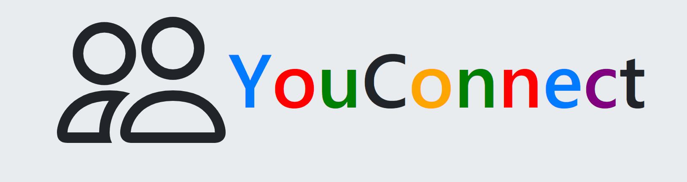

# Full-Stack Application - YouConnect

## Table of contents
  * [Problem Statement](#problem-statement)
  * [User Stories](#user-stories)
  * [Future Development](#future-development)
  * [Getting Started](#getting-started)
  * [Prerequisites](#prerequisites)
  * [Built With](#built-with)
  * [Project Details](#project-details)
  * [Author](#author)
  * [Acknowledgments](#acknowledgments)

## Problem Statement
YouConnect can be used to connect with various networks, search for and communicate with the contacts. The application will be enhanced to form micronetwork groups and leverage the groups for services.  

## User Stories
YouConnect is a full stack application built using **Node.js, Mongoose, Express, EJS and Bootstrap**. The Application has the following workflows: 
  - **Sign Up** New users can sign up in the application
  - **Authorization/Login** Only authorized users can login into the application
  - **Find** After login, users can fing the connections by name/email search
  - **Connect** Users can form one's own network from the connections
  - **View Connections** Users can view the profiles of the connections
  - **Send Messages** Users can send messages to their connections
  - **Receive Messages** Users can receive messages from their connections
  - **Edit Profile** Users can edit their profiles

## Future Development
 * Searching connections by zipcode/Location
 * Profile enhancements and new user invitations
 * Advanced chat/messaging and network groups
 * Network services

## Getting Started
YouConnect is hosted on Heroku:
 * [YouConnect](https://networkskapp.herokuapp.com/)

## Prerequisites
 - Web Browser (Chrome, or Mozilla, or Safari, or Opera, or Microsoft Edge )

## Built With
- [Node](https://nodejs.org) - JavaScript Runtime Environment
- [Npm](https://www.npmjs.com) - Package Manager
- [Express](https://expressjs.com/en/starter/installing.html) - Web Framework
- [EJS](https://www.npmjs.com/package/ejs) - Web Framework
- [MongoDB](https://www.mongodb.com) - Database
- [Mongoose](http://mongoosejs.com) - Database ORM
- [Bootstrap](https://getbootstrap.com/) - Fron End Toolkit
- [VS Code](https://code.visualstudio.com) - Code Editor

## Author
* [Sasi Koramutla](https://github.com/Sasi-Koramutla)

## Acknowledgments
* General Assembly
* Family and Friends